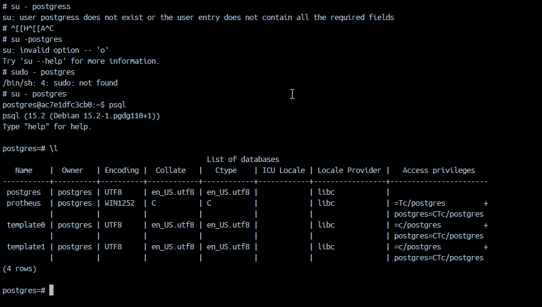

https://docker-protheus.engpro.totvs.com.br/00-tutorial-protheus-docker/

# Pasta RPO e Dicionario deve ser preenchida com os dados do suporte.totvs.com.br

# Gerar .ini 

docker run --rm 
    -v ${PWD}:/local 
    --workdir=/local 
    totvsengpro/dbaccess-postgres-dev 
        /opt/totvs/dbaccess/tools/dbaccesscfg 
        -u postgres 
        -p postgres 
        -a protheus 
        -d postgres 
        -c '/usr/lib64/libodbc.so' 
        -o 'ConnectionMode=2;ConnectionString=DRIVER!{PostgreSQL}@SERVERNAME!postgres-iniciado@PORT!5432@DATABASE!protheus@USERNAME!postgres@PASSWORD!postgres' 
        -g 'LicenseServer=license;LicensePort=5555'

# verifica o banco do postgress

# /etc/odbc.ini
[Protheus]
DRIVER=/usr/lib64/psqlodbcw.so
SERVERNAME=postgres-iniciado
PORT=5432
DATABASE=protheus
USERNAME=postgres
PASSWORD=postgres

Para isso funcionar precisar comentar essas tags 
;ConnectionMode=2
;ConnectionString=DRIVER!{PostgreSQL}@SERVERNAME!postgres-iniciado@PORT!5432@DATABASE!protheus@USERNAME!postgres@PASSWORD!postgres

~